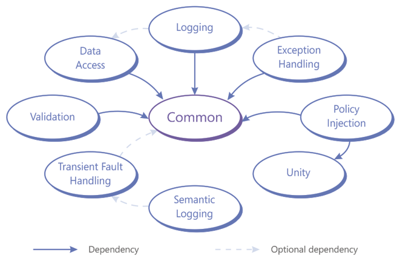

:warning: **This project is no longer under development. It is hosted here for historical archive.**

# Microsoft Enterprise Library 6

Microsoft Enterprise Library is a collection of reusable software components (application blocks) addressing common cross-cutting concerns. Each application block is now hosted in its own repository. This site serves as a hub for the entire Enterprise Library. The latest source code here only include the sample application, which utilizes all of the application blocks.

Enterprise Librarywas developed by the patterns & practices team and in collaboration with the community. 

_This respository contains all source code for Microsoft Enterprise Library, including unit and integration tests._

Constituent projects
* https://github.com/MicrosoftArchive/enterprise-library-common-infrastructure
* https://github.com/unitycontainer/unity (community owned)
* https://github.com/MicrosoftArchive/semantic-logging
* https://github.com/MicrosoftArchive/logging-application-block
* https://github.com/MicrosoftArchive/exception-handling-application-block
* https://github.com/MicrosoftArchive/data-access-application-block
* https://github.com/MicrosoftArchive/transient-fault-handling-application-block
* https://github.com/MicrosoftArchive/validation-application-block
* https://github.com/MicrosoftArchive/policy-injection-application-block

Microsoft patterns & practices
http://aka.ms/architecture
